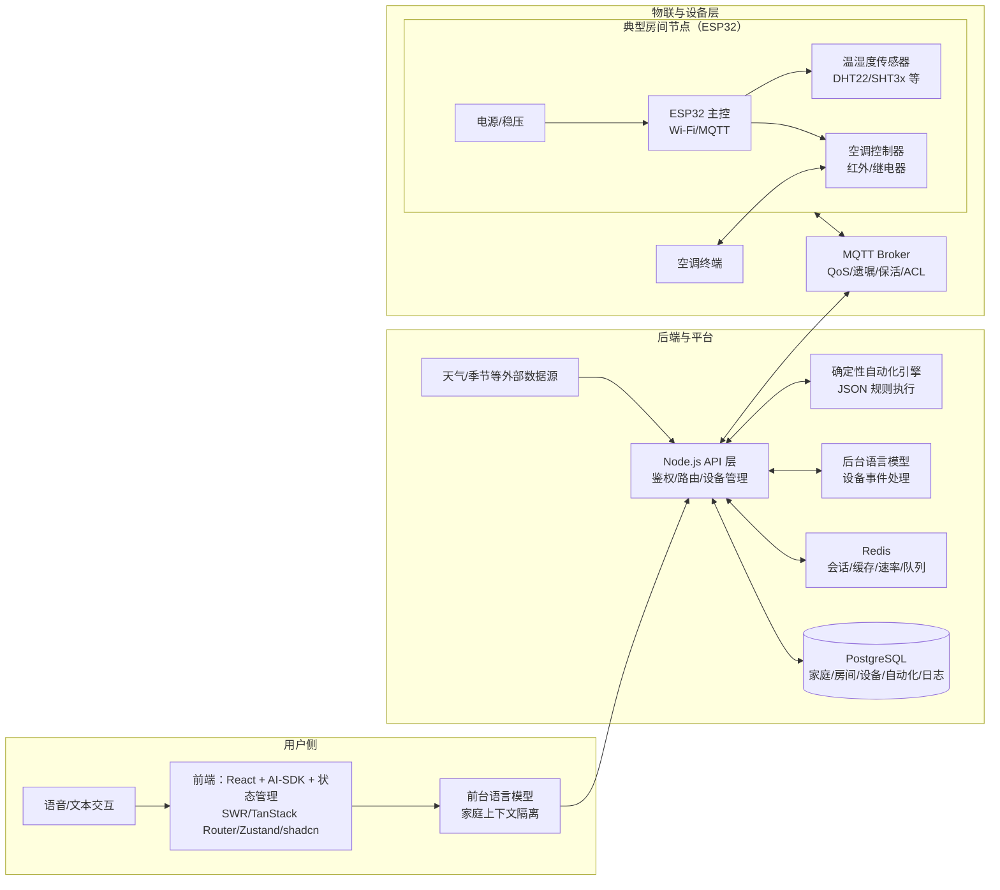
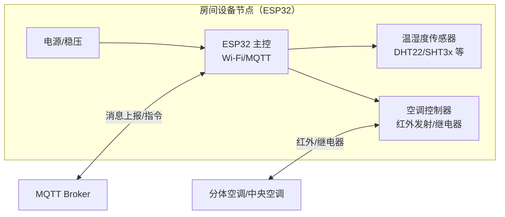

# 系统框图

## 系统总体框图（硬件 + 软件）

## ESP32 典型硬件架构示例（温湿度传感器 + 空调控制器）

## 交互与数据流
- 设备上报：传感器周期/事件上报 -> MQTT -> API -> Redis/PG 记录 -> 触发自动化或后台模型判定 -> 指令经 MQTT 下发 -> 触发器执行。
- 用户控制：语音/文本 -> 前端 -> 前台模型（按家庭上下文） -> API -> 指令下发或状态读取 -> 设备反馈。
- 预设自动化：内置典型模板（如房间温湿度 + 季节 + 当天天气 -> 空调/加湿器/除湿器联动），可配置开关；与家庭上下文隔离存储。
- 自定义自动化：前端自然语言或 JSON 配置 -> API 校验/存储 -> 自动化引擎调度执行，独立于语言服务。
- 外部数据：天气/季节等数据周期获取 -> 参与自动化/模型决策，节流与缓存由 Redis 控制。

## 硬件架构要点
- 设备：基于 ESP32（运行 Arduino），封装传感器与触发器；支持 OTA/重连与离线缓冲（如本地队列）。
- 通信：MQTT 主题与消息规范化，含设备注册、心跳、状态上报、指令下发、事件回调；使用 QoS/遗嘱保持设备状态可靠。
- 标识：家庭 -> 房间层级标签，设备类型/ID/名称必填，便于语音定位与自动化匹配。

## 软件架构要点
- 前端：React + AI-SDK，提供家庭/房间/设备管理、自动化配置、语音/文本控制；前台模型按家庭隔离上下文。
- 后端：Node.js + AI-SDK，统一 API、鉴权、设备/自动化管理；Redis 做会话/缓存/节流/队列；PostgreSQL 做持久化与审计。
- 模型分工：前台模型面向用户交互；后台模型面向设备事件与联动判定，互不干扰。
- 自动化引擎：确定性 JSON 规则执行通道，优先使用非 LLM 链路；支持模板预设与开关。
- 可观测性：日志/指标记录模型调用、设备上下行、自动化执行结果，便于调试与回溯。

